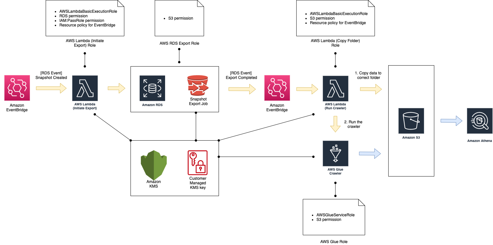

# AWS RDS Snapshot export to AWS Athena

This document describes a setup for loading AWS RDS snapshot data into AWS Athena.

## Overview

Setup outlined in this document assumes that you have your data stored in RDS. In this case the database engine is Aurora, but the procedure shouldn’t differ much for other database engines.

Basic setup is as follows:

```
RDS → S3 → Glue (Crawler) → Athena
```

More detailed diagram of the setup  is shown below:



1. First step is to have a ready snapshot of your RDS data. You can setup your RDS cluster to perform an automated (also called “system”) snapshot taken every night. 

2. Moving the RDS snapshot data into S3 is done via out-of-the-box solution by AWS which performs the export for you. However, at the time of writing this text, it was not possible to automatise or schedule the export job directly.

3. In order to automatise the export job, three steps need to be taken:
  
    1. Prepare a Lambda that will find the ID of the latest system snapshot for your database and trigger the export job. This will copy the data into the S3 bucket of your choice, in a folder that has the same name as the export job ID. Because every export job ID is unique, and because at the time of writing this text they could not be deleted, this means that we will end up with a new S3 folder for every export job (e.g. `rds-snapshot-export-{date}`).
  
    2. Prepare a Lambda that prepares the data and invokes the AWS Glue Crawler (see step 4). Copying the data is necessary to move it from the daily folder (e.g. `rds-snapshot-export-{date}`) to the main folder (e.g. `rds-snapshot-export`), at which point the daily one is deleted. After this has been done, Lambda invokes the AWS Glue Crawler.

    3. Prepare EventBridge rules that will trigger:
    - Lambda `i` on Automated cluster snapshot created event
    - Lambda `ii` on Export task completed event 

4. Moving the data from S3 to Athena is done via AWS Glue, which defines a Crawler that takes care of the export for us. All we have to do is:

    1. Prepare the Athena table that will hold the exported data. 

    2. Configure the Crawler to copy the data from our S3 bucket into the prepared Athena table. 

    3. Invoke the Crawler from AWS Lambda (see step 3-ii).  

5. In order to be able to encrypt / decrypt the data, we need to set up a KMS key that will be used by the resources described above (RDS, S3, Lambda and Glue).

6. In order to allow the AWS services to access the needed resources, we need to set up a separate IAM role for each.
 
Refer to the CloudFormation [template](cf_template.yaml) for exact information about the necessary services.


